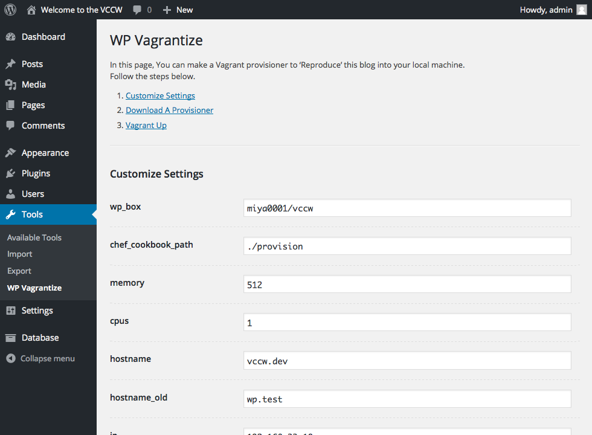
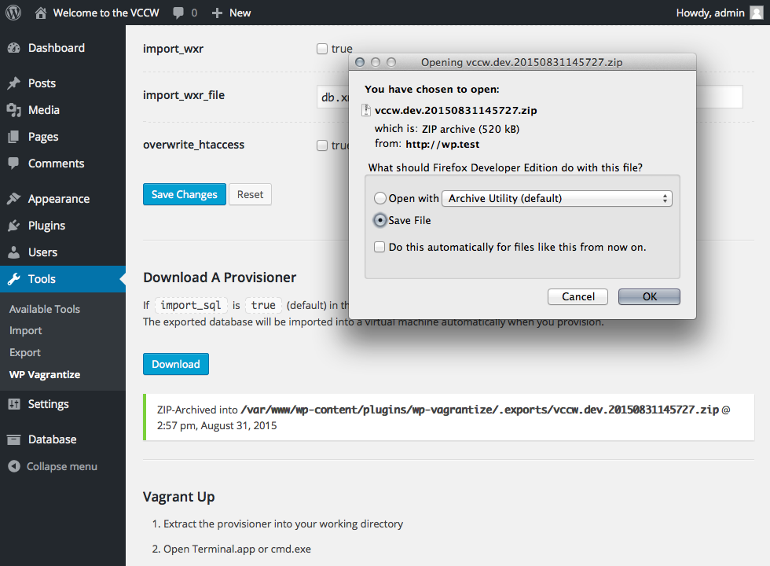

# WP Vagrantize #
+ Contributors: amekusa
+ Tags: vagrant, development
+ Requires at least: 3.5.2
+ Tested up to: 3.5.2
+ Stable tag: 4.3
+ License: GPLv2
+ License URI: http://www.gnu.org/licenses/gpl-2.0.html

A smart way to reproduce your blog into the local machine

## Description ##

WP Vagrantize provides quick, easy and efficiant way to build local development environment for your WordPress site.

In *Tools* menu, you can customize and download a Vagrant provisioning file which contains a `Vagrantfile`.
If you are an administrator, you can also export a database, and Vagrant imports it automatically when provisioning.

## Installation ##

You can install WP Vagrantize in the ordinary way.

### How to use ###
1. In the admin, navigate into *Tools* > *WP Vagrantize*
2. Follow the instruction of the page
3. Unzip the file you downloaded
4. `vagrant` it `up`

### Prerequisites ###
1. [Oracle VM VirtualBox](https://www.virtualbox.org/) or [VMware Fusion](http://www.vmware.com/products/fusion)
2. [Vagrant](https://www.vagrantup.com/)

## Screenshots ##

1. Customizing settings of a virtual machine 
2.  Downloading a provisioning file as a ZIP

## Changelog ##

### 1.2.0 ###
* Upgrade ReWP to 1.7.1 that is compatible with VCCW 2.17.0
* Update internal libraries

### 1.1.1 ###
* Fix some downloader issues

### 1.1.0 ###
* Integrate DB exporting feature into download
* Enhance security

### 1.0.0 ###
* Initial release

## Upgrade Notice ##

### 1.2.0 ###
Upgrade ReWP to 1.7.1 that is compatible with VCCW 2.17.0

### 1.1.1 ###
Fix some downloader issues

### 1.1.0 ###
Security enhancements

### 1.0.0 ###
Initial release
